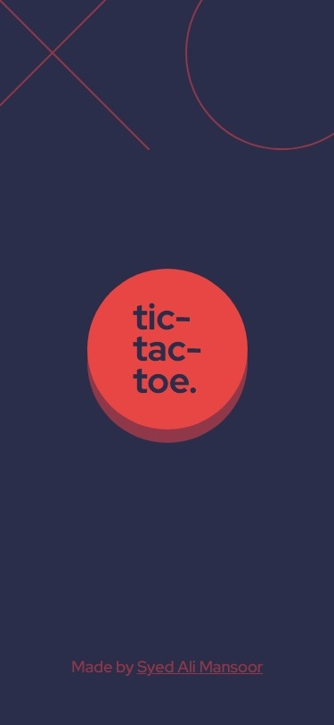
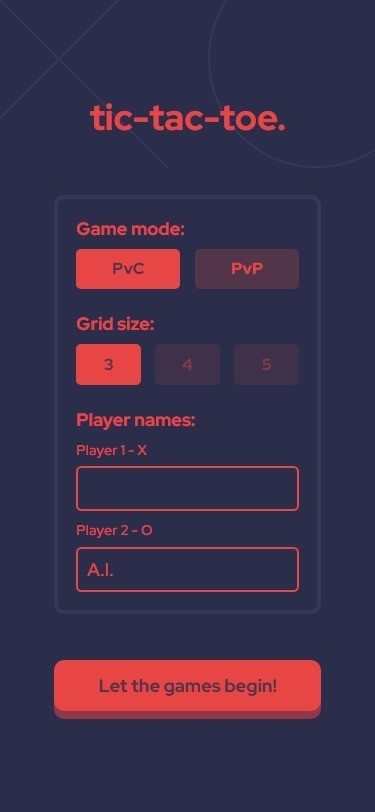
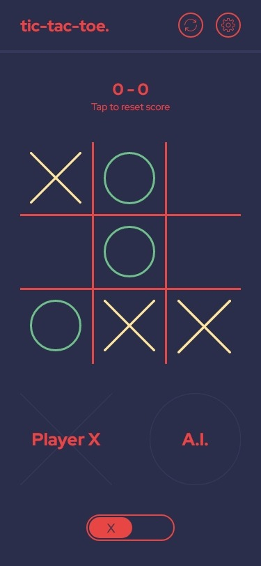
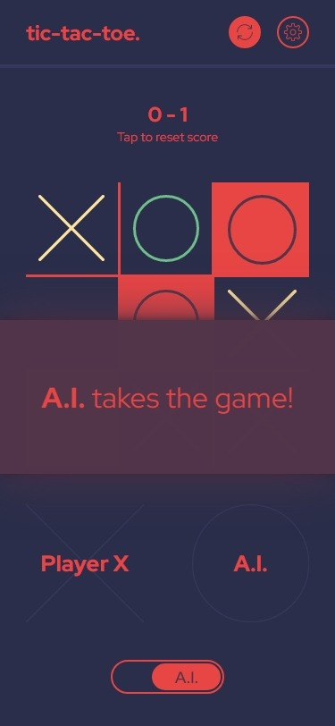

# Tic Tac Toe Game (PvC and PvP)

Welcome! This is a responsive browser-based tic-tac-toe game with support for competing against a human or a computer, and an adjustable board size.

[View it live!](https://alimansoor-create.github.io/tic-tac-toe-react)

---

\

## Instructions

- Press the large "tic-tac-toe" button to start
- Choose a mode "PvC" (Player vs Computer) or "PvP" (Player vs Player)
- Select a size for the grid (PvC mode only works with a grid size of 3)
- Enter the name(s) of the player(s)
- Press the "Let the games begin!" button to start the game
- Enjoy!

## Screenshots

## Features

- Two game modes: PvP or PvC
- Board size selection: 3/4/5
- Player score tracking
- Current player indication

## Methodologies

- Board state calculation using the [counter approach](https://dev.to/alimansoorcreate/building-a-tic-tac-toe-game-with-react-from-scratch-ideation-2a1e)
- Best-possible-move calculation using the [Minimax algorithm](https://dev.to/alimansoorcreate/building-a-tic-tac-toe-game-with-react-from-scratch-ideation-2a1e)
